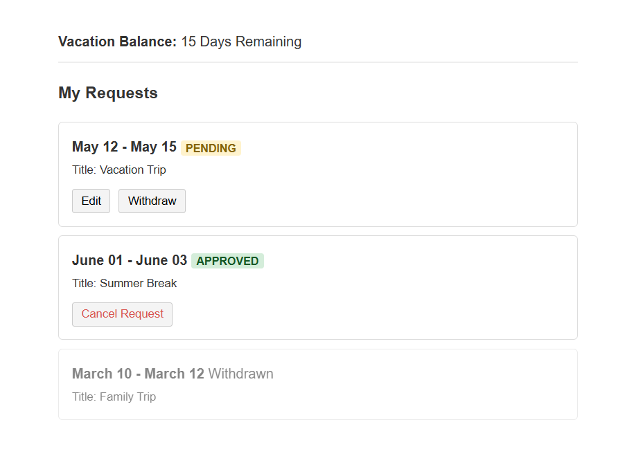
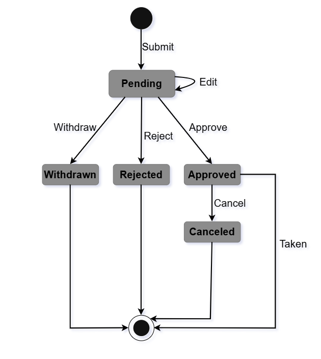
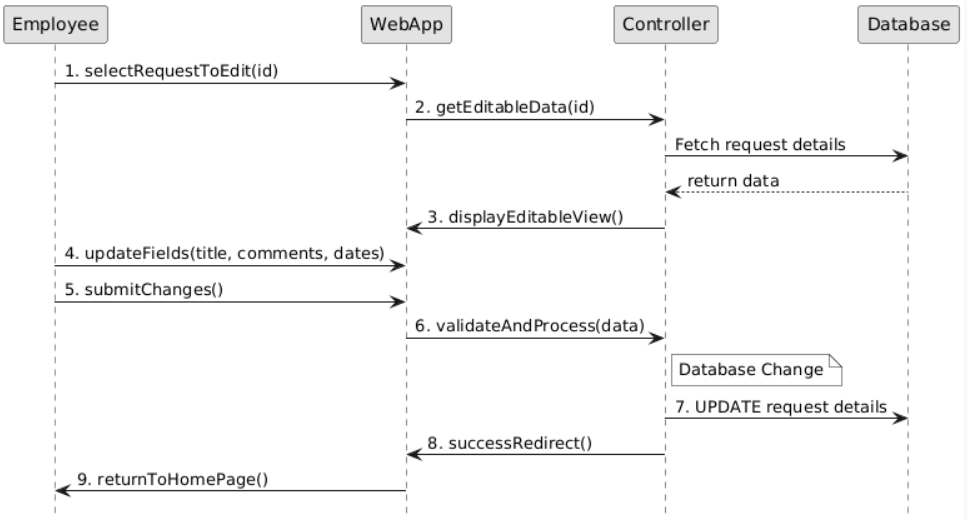
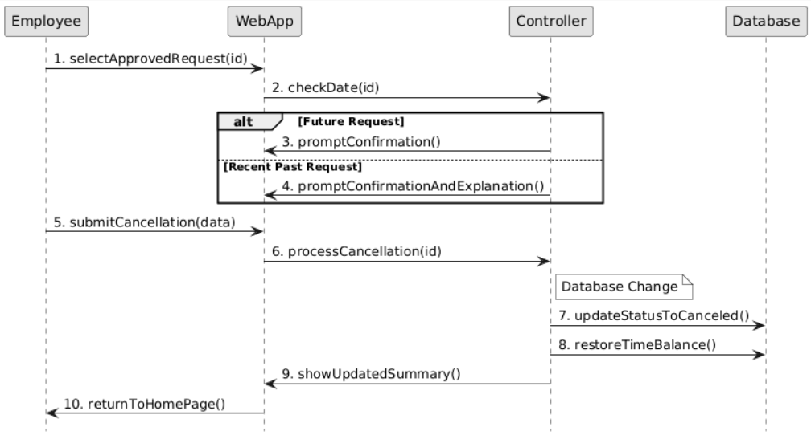
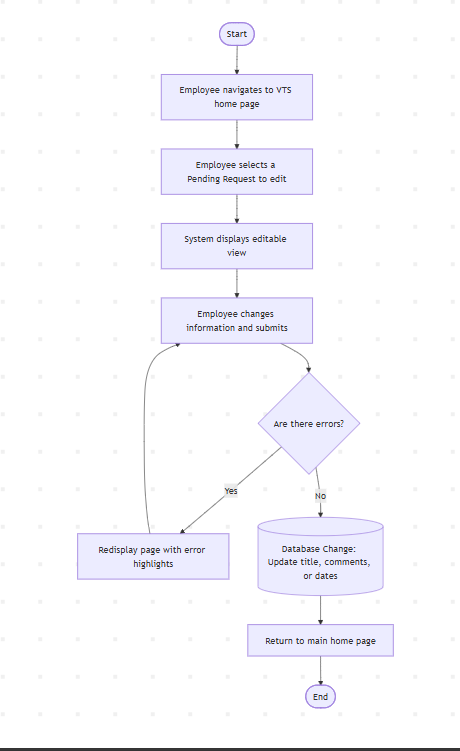
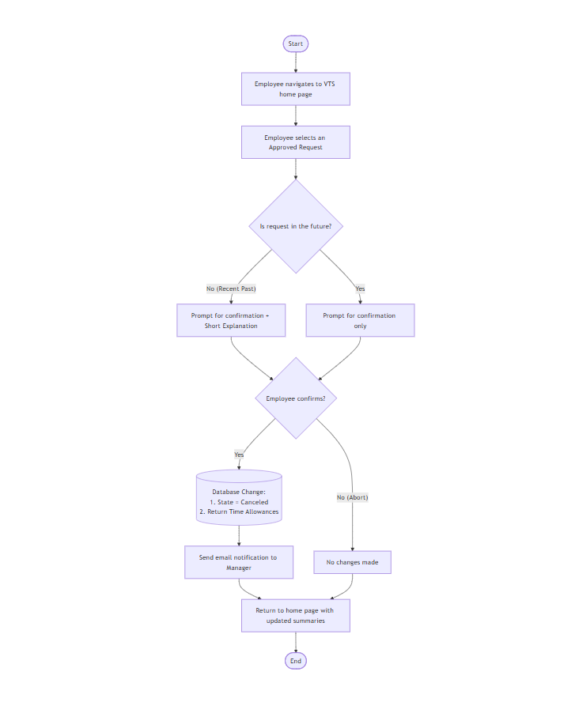

# request-management-system
#  Request Management System - Tasks

##  1. UI Design

Simple interface showing how requests are displayed for employees and managers.  
Each user can interact with requests based on their role.

---

##  2. State Machine

Illustrates the lifecycle of a request from creation to approval or rejection.  
Shows how the request moves between different states.

---

##  3. Sequence Diagrams from alternative flows in CH12

###  Edit Request

Shows the interaction flow when a user edits a request.  
Includes validation and updating the system.

###  Cancel Request

Describes how a request is canceled by the user.  
Covers the steps from action to system update.

---

##  4. Flowcharts

###  Edit Request Flow

Represents the steps for modifying a request.  
Includes decision points and update process.

###  Cancel Request Flow

Shows the logic behind canceling a request.  
Illustrates conditions and final status update.
